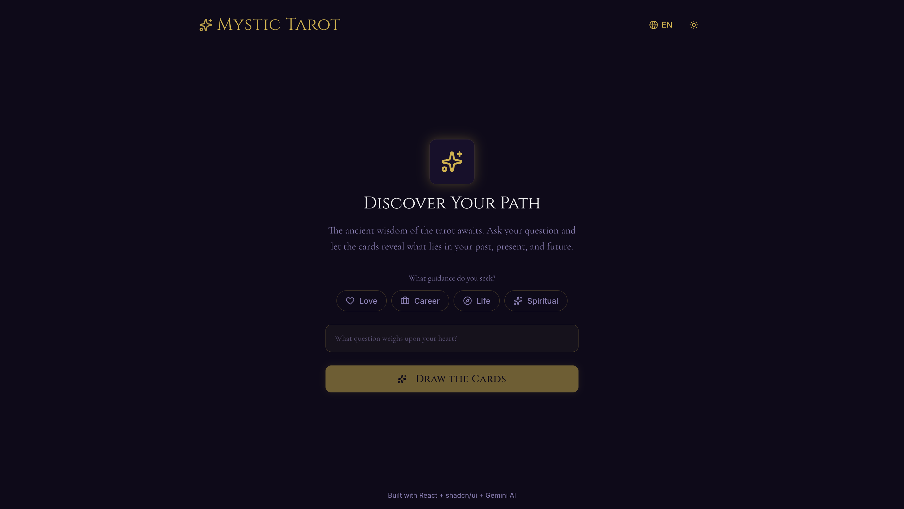
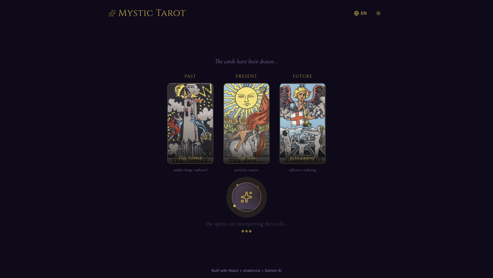
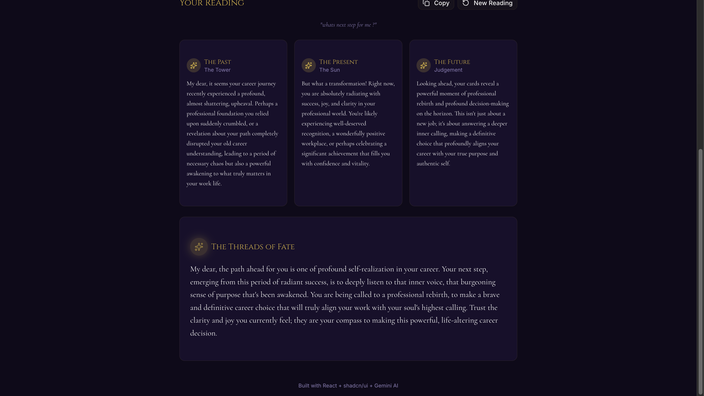

# Mystic Tarot

An AI-powered tarot card reading web application with mystical dark theme and 3-card spreads (Past/Present/Future). Built with React, TypeScript, and Google Gemini AI.


## Features

- **Topic-Based Readings** - Choose from Love, Career, Life, or Spiritual guidance
- **Bilingual Support** - Switch between English and Indonesian (Bahasa Indonesia)
- **3-Card Spread** - Past, Present, and Future layout with structured interpretations
- **AI-Powered Readings** - Personal, context-aware readings generated by Google Gemini
- **Real Tarot Cards** - Authentic Rider-Waite card imagery
- **Card Flip Animations** - Dramatic reveal effects with smooth 3D transitions
- **Card Detail on Hover** - View card meanings by hovering/tapping revealed cards
- **Mystical Loading Animation** - Crystal ball effect while generating readings
- **Dark/Light Mode** - Toggle between mystical themes
- **Responsive Design** - Works on all devices
- **Copy Reading** - Share your reading with others

## Screenshots

### Home Screen


### Cards Revealed


### Reading Result


## Demo

1. Select your topic (Love, Career, Life, or Spiritual)
2. Ask your question
3. Watch the cards flip and reveal
4. Receive personalized interpretations for each card
5. Read the unified synthesis that weaves your reading together

## Tech Stack

| Technology | Purpose |
|------------|---------|
| [React 19](https://react.dev/) | UI Framework |
| [TypeScript](https://www.typescriptlang.org/) | Type Safety |
| [Vite](https://vite.dev/) | Build Tool |
| [Tailwind CSS v4](https://tailwindcss.com/) | Styling |
| [shadcn/ui](https://ui.shadcn.com/) | UI Components |
| [Google Gemini](https://ai.google.dev/) | AI Readings |
| [Lucide React](https://lucide.dev/) | Icons |

## Getting Started

### Prerequisites

- Node.js 18+
- npm or yarn
- Google Gemini API key (free tier available)

### Installation

1. Clone the repository:
```bash
git clone https://github.com/ilhammramadhan/ai-tarot-reader.git
cd ai-tarot-reader
```

2. Install dependencies:
```bash
npm install
```

3. Create a `.env` file in the root directory:
```bash
cp .env.example .env
```

4. Add your Gemini API key to `.env`:
```
VITE_GEMINI_API_KEY=your_api_key_here
```

5. Get your free API key from [Google AI Studio](https://aistudio.google.com/app/apikey)

6. Start the development server:
```bash
npm run dev
```

7. Open [http://localhost:5173](http://localhost:5173) in your browser.

## Project Structure

```
mystic-tarot/
├── src/
│   ├── components/
│   │   ├── ui/                  # shadcn/ui components
│   │   ├── CardSpread.tsx       # 3-card layout
│   │   ├── Header.tsx           # App header with language & theme toggle
│   │   ├── LoadingAnimation.tsx # Crystal ball loading effect
│   │   ├── QuestionInput.tsx    # Question form with topic selector
│   │   ├── ReadingResult.tsx    # Structured reading display
│   │   ├── TarotCard.tsx        # Card with flip animation & hover detail
│   │   ├── ThemeProvider.tsx    # Dark/light theme context
│   │   └── TopicSelector.tsx    # Love/Career/Life/Spiritual selector
│   ├── contexts/
│   │   └── LanguageContext.tsx  # EN/ID translations
│   ├── data/
│   │   └── tarotCards.ts        # 22 Major Arcana cards with images
│   ├── hooks/
│   │   └── useGemini.ts         # Gemini API integration
│   ├── lib/
│   │   └── utils.ts
│   ├── App.tsx
│   ├── main.tsx
│   └── index.css                # Mystical theme styles & animations
├── .env.example
├── index.html
├── package.json
└── README.md
```

## Design System

### Color Palette

| Color | Hex | Usage |
|-------|-----|-------|
| Background | `#0f0a1a` | Deep purple-black |
| Gold | `#D4AF37` | Primary, accents |
| Violet | `#A78BFA` | Secondary |
| Muted | `#8B7DB5` | Muted text |

### Topic Colors

| Topic | Color |
|-------|-------|
| Love | Pink |
| Career | Blue |
| Life | Green |
| Spiritual | Violet |

### Typography

- **Headings**: Cinzel (serif)
- **Body**: Inter (sans-serif)
- **Mystical Text**: Cormorant (italic serif)

## How It Works

1. **Select Topic**: Choose Love, Career, Life, or Spiritual
2. **Ask Question**: Enter your question for the cards
3. **Card Drawing**: 3 random cards are drawn from the Major Arcana
4. **Animation**: Cards flip one by one with staggered timing
5. **AI Reading**: Gemini generates a personalized interpretation:
   - **Per-card readings**: Specific insights for Past, Present, Future
   - **Synthesis**: Unified narrative answering your question
6. **Explore**: Hover over cards to see detailed meanings

## Deployment

### Deploy to Vercel (Recommended)

1. Push your code to GitHub
2. Go to [vercel.com](https://vercel.com)
3. Import your repository
4. Add environment variable: `VITE_GEMINI_API_KEY`
5. Click Deploy

[](https://vercel.com/new/clone?repository-url=https://github.com/ilhammramadhan/ai-tarot-reader)

### Build for Production

```bash
npm run build
```

Output will be in the `dist/` folder.

## Available Scripts

| Command | Description |
|---------|-------------|
| `npm run dev` | Start development server |
| `npm run build` | Build for production |
| `npm run preview` | Preview production build |
| `npm run lint` | Run ESLint |

## Contributing

Contributions are welcome! Feel free to:

1. Fork the repository
2. Create a feature branch (`git checkout -b feature/amazing-feature`)
3. Commit your changes (`git commit -m 'Add amazing feature'`)
4. Push to the branch (`git push origin feature/amazing-feature`)
5. Open a Pull Request

## License

This project is open source and available under the [MIT License](LICENSE).

## Author

**Mochammad Ilham Ramadhan**

- GitHub: [@ilhammramadhan](https://github.com/ilhammramadhan)
- LinkedIn: [Mochammad Ilham Ramadhan](https://linkedin.com/in/ilhamm-ramadhan)

---

*May the cards reveal your destiny...*
